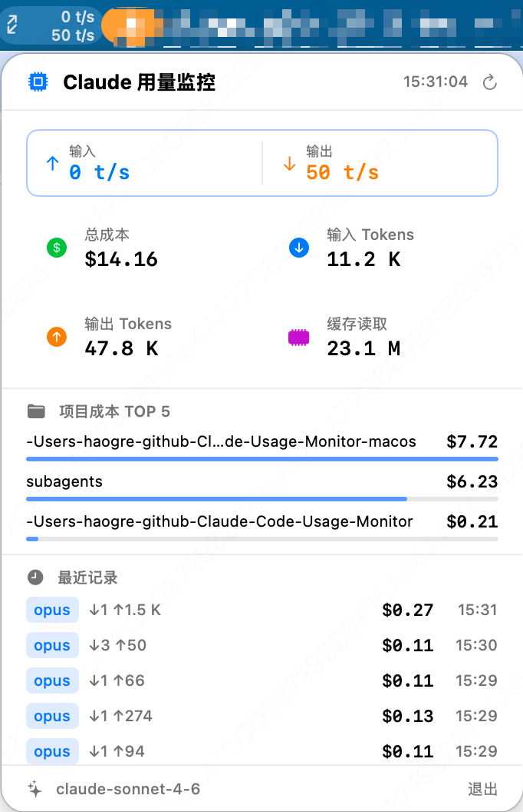

# ClaudeMonitor for macOS

[](https://www.apple.com/macos/)
[](https://swift.org/)
[](https://developer.apple.com/xcode/swiftui/)
[](https://opensource.org/licenses/MIT)

A native macOS menu bar app that monitors your **Claude Code** token usage and costs in real-time. Built entirely in Swift with zero external dependencies.

> Inspired by [Maciek-roboblog/Claude-Code-Usage-Monitor](https://github.com/Maciek-roboblog/Claude-Code-Usage-Monitor).

<p align="center">
  
</p>

---

## Screenshot

<p align="center">
  
</p>

---

## Features

- **Live menu bar indicator** -- double-row token rates when active, accumulated cost when idle
- **Detail panel** -- total cost, input/output tokens, cache reads, top 5 projects, recent records
- **Auto refresh** -- updates every 5 seconds with smoothed per-second rates
- **Deduplication** -- skips duplicate entries via `message_id:request_id` hash
- **Multi-model pricing** -- Opus / Sonnet / Haiku with accurate per-token cost calculation
- **Zero dependencies** -- pure Swift + SwiftUI, no third-party packages
- **Universal binary** -- runs natively on both Intel and Apple Silicon Macs

---

## Install

### Option 1: Download DMG (Recommended)

1. Go to [Releases](https://github.com/HAOGRE/ClaudeMonitor-macOS/releases/latest)
2. Download `ClaudeMonitor.dmg`
3. Open DMG, drag `ClaudeMonitor.app` to **Applications**
4. Launch -- the app appears in the menu bar (no Dock icon)

> First launch: right-click the app and select "Open" to bypass Gatekeeper.

### Option 2: Build from Source

```bash
git clone https://github.com/HAOGRE/ClaudeMonitor-macOS.git
cd ClaudeMonitor-macOS
open ClaudeMonitor/ClaudeMonitor.xcodeproj
# Press Cmd+R to build and run
```

**Requirements:** macOS 14.0+, Xcode 15.3+, Claude Code installed (`~/.claude/projects/`)

---

## How It Works

```
~/.claude/projects/<project>/*.jsonl
        |
        v
  TokenDataReader.swift        -- parse JSONL, extract tokens, calculate cost, deduplicate
        |
        v
  MonitoringViewModel.swift    -- aggregate totals, compute rates, manage UI state
        |
        v
  ClaudeMonitorApp.swift       -- render menu bar label (NSImage)
  StatusBarView.swift           -- render detail panel (SwiftUI)
```

Claude Code writes JSONL session files. The app reads them directly -- no network requests, no daemon, no external servers. All data stays local.

### Pricing Table

| Model  | Input ($/1M) | Output ($/1M) | Cache Create ($/1M) | Cache Read ($/1M) |
|--------|:---:|:---:|:---:|:---:|
| Opus   | $15.00 | $75.00 | $18.75 | $1.50 |
| Sonnet | $3.00  | $15.00 | $3.75  | $0.30 |
| Haiku  | $0.25  | $1.25  | $0.30  | $0.03 |

If a JSONL entry includes `cost_usd`, that value is used directly.

---

## Project Structure

```
ClaudeMonitor/
├── ClaudeMonitor.xcodeproj/
└── ClaudeMonitor/
    ├── ClaudeMonitorApp.swift          # App entry, MenuBarExtra, menu bar label
    ├── StatusBarView.swift             # Detail panel UI
    ├── Backend/
    │   ├── TokenDataReader.swift       # JSONL parser, pricing engine
    │   └── MonitoringViewModel.swift   # Observable state, auto-refresh
    └── Assets.xcassets/                # App icon
```

---

## FAQ

**Does this app send data externally?**
No. It only reads local files. Zero network requests.

**What if `~/.claude/projects` doesn't exist?**
The app shows a hint message and starts displaying data automatically once Claude Code creates sessions.

**How accurate is the cost estimate?**
Pricing matches the official Anthropic API rates. When `cost_usd` is present in the JSONL data, that exact value is used.

---

## Credits

Native macOS reimplementation of [Maciek-roboblog/Claude-Code-Usage-Monitor](https://github.com/Maciek-roboblog/Claude-Code-Usage-Monitor). The original Python project provided the foundation for JSONL parsing, token extraction, pricing model, and deduplication logic.

---

## License

[MIT](LICENSE)
