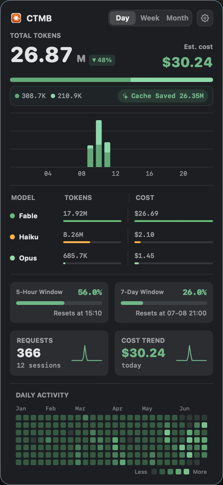
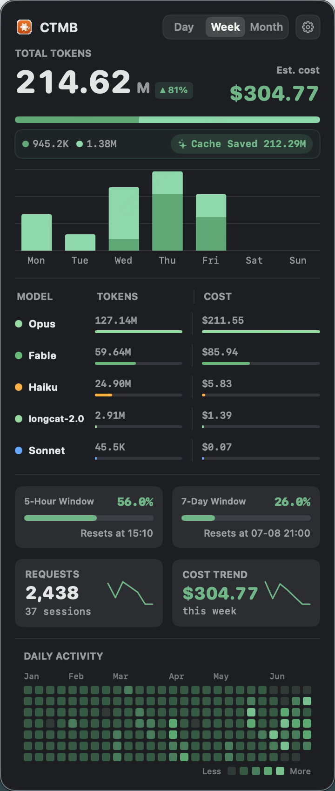
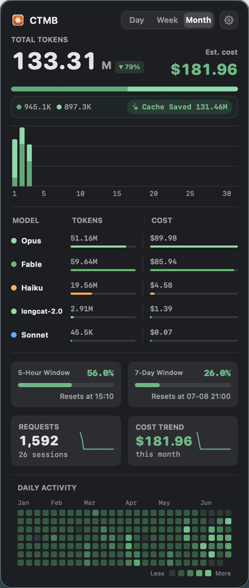
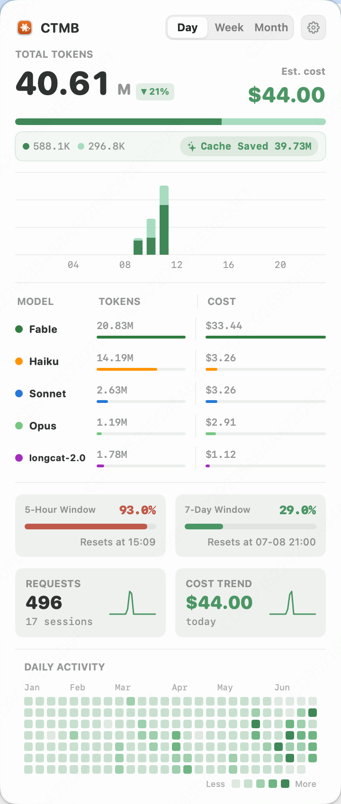
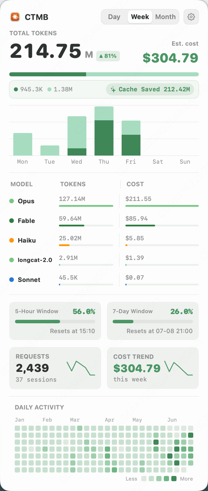
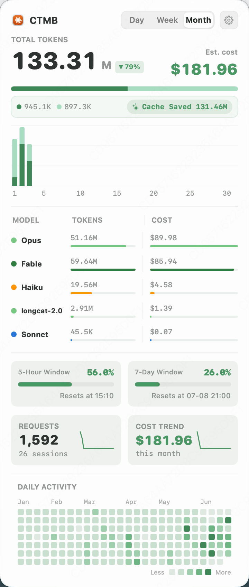

# Claude Token Monitor Bar (CTMB) for macOS

[](https://www.apple.com/macos/)
[](https://swift.org/)
[](https://developer.apple.com/xcode/swiftui/)
[](https://github.com/HAOGRE/ClaudeTokenMonitorBar-macOS/releases/latest)
[](https://opensource.org/licenses/MIT)

A native macOS menu bar companion app that monitors your **Claude Code** token usage and costs in real-time. Built entirely in Swift/SwiftUI with zero external dependencies.

**CTMB** is the short name for **Claude Token Monitor Bar**. The shared Xcode schemes are `CTMB` for the GitHub distribution and `CTMB AppStore` for the App Store build.

> **Companion app** for [Maciek-roboblog/Claude-Code-Usage-Monitor](https://github.com/Maciek-roboblog/Claude-Code-Usage-Monitor) — consumes the v4 state protocol output and displays it in a native macOS menu bar interface.

<p align="center">
  
</p>

---

## Screenshot

### Dark Mode

<p align="center">
  
  
  
</p>
<p align="center">
  <sub>Day</sub> &nbsp;&nbsp;&nbsp;&nbsp;&nbsp;&nbsp;&nbsp;&nbsp;&nbsp;&nbsp;&nbsp;&nbsp;&nbsp;&nbsp;&nbsp;&nbsp;&nbsp;&nbsp;&nbsp;&nbsp;&nbsp;&nbsp;&nbsp;&nbsp;&nbsp;&nbsp;&nbsp;&nbsp;&nbsp;&nbsp;&nbsp;&nbsp;&nbsp;&nbsp;&nbsp;&nbsp;&nbsp;&nbsp;&nbsp;&nbsp; <sub>Week</sub> &nbsp;&nbsp;&nbsp;&nbsp;&nbsp;&nbsp;&nbsp;&nbsp;&nbsp;&nbsp;&nbsp;&nbsp;&nbsp;&nbsp;&nbsp;&nbsp;&nbsp;&nbsp;&nbsp;&nbsp;&nbsp;&nbsp;&nbsp;&nbsp;&nbsp;&nbsp;&nbsp;&nbsp;&nbsp;&nbsp;&nbsp;&nbsp;&nbsp;&nbsp;&nbsp;&nbsp;&nbsp;&nbsp;&nbsp;&nbsp; <sub>Month</sub>
</p>

### Light Mode

<p align="center">
  
  
  
</p>
<p align="center">
  <sub>Day</sub> &nbsp;&nbsp;&nbsp;&nbsp;&nbsp;&nbsp;&nbsp;&nbsp;&nbsp;&nbsp;&nbsp;&nbsp;&nbsp;&nbsp;&nbsp;&nbsp;&nbsp;&nbsp;&nbsp;&nbsp;&nbsp;&nbsp;&nbsp;&nbsp;&nbsp;&nbsp;&nbsp;&nbsp;&nbsp;&nbsp;&nbsp;&nbsp;&nbsp;&nbsp;&nbsp;&nbsp;&nbsp;&nbsp;&nbsp;&nbsp; <sub>Week</sub> &nbsp;&nbsp;&nbsp;&nbsp;&nbsp;&nbsp;&nbsp;&nbsp;&nbsp;&nbsp;&nbsp;&nbsp;&nbsp;&nbsp;&nbsp;&nbsp;&nbsp;&nbsp;&nbsp;&nbsp;&nbsp;&nbsp;&nbsp;&nbsp;&nbsp;&nbsp;&nbsp;&nbsp;&nbsp;&nbsp;&nbsp;&nbsp;&nbsp;&nbsp;&nbsp;&nbsp;&nbsp;&nbsp;&nbsp;&nbsp; <sub>Month</sub>
</p>

---

## Features

- **Live menu bar indicator** — double-row token rates (↗ input / ↙ output) when Claude is active; switches to accumulated cost when idle
- **Official Rate Limits (v4)** — when [claude-code-usage-monitor](https://github.com/Maciek-roboblog/Claude-Code-Usage-Monitor) is running, shows the 5-hour token window with a color-coded progress bar and reset time
- **Detail panel** — total / today's cost, input / output / cache tokens, top 5 projects by cost, recent 5 records, 30-day trend chart (collapsible)
- **Auto-refresh** — updates every 5 seconds with smoothed per-second rates
- **Deduplication** — skips duplicate entries via `message_id:request_id` hash, matching the Python project's logic exactly
- **Multi-model pricing** — Fable 5, Opus, Sonnet, Haiku with accurate per-token cost calculation
- **i18n** — English and Chinese UI, defaults to system locale
- **Zero dependencies** — pure Swift + SwiftUI, no third-party packages
- **Universal binary** — runs natively on both Intel and Apple Silicon Macs

---

## Install

### Option 1: Homebrew (Recommended) ⏳

> **Status**: [Pending Review](https://github.com/Homebrew/homebrew-cask/pull/272983) — not yet available

Once approved:
```bash
brew install --cask claude-token-monitor-bar
```

Then launch **ClaudeTokenMonitorBar** from Launchpad or Applications folder.

> **⚠️ First Launch / 首次启动**
>
> Since the app is not notarized, macOS Gatekeeper will show a security warning:
>
> ```
> "ClaudeTokenMonitorBar" Not Opened
> Apple could not verify "ClaudeTokenMonitorBar" is free of malware...
> [Move to Trash] [Done]
> ```
>
> **To proceed / 解决方法：**
>
> 1. Click **"Done"** (NOT "Move to Trash") / 点击 **"完成"**（不要点"移到废纸篓"）
> 2. Open **System Settings → Privacy & Security** / 打开**系统设置 → 隐私与安全性**
> 3. Scroll down to find **"ClaudeTokenMonitorBar"** was blocked / 找到 **"已阻止使用 ClaudeTokenMonitorBar"**
> 4. Click **"Open Anyway"** / 点击 **"仍要打开"**
> 5. Click **"Open"** on the confirmation dialog / 在确认对话框点击 **"打开"**
>
> **Alternative: Command Line / 命令行方式：**
> ```bash
> xattr -d com.apple.quarantine /Applications/ClaudeTokenMonitorBar.app
> ```

### Option 2: Download DMG

1. Go to [Releases](https://github.com/HAOGRE/ClaudeTokenMonitorBar-macOS/releases/latest)
2. Download `ClaudeTokenMonitorBar-v1.2.1.dmg`
3. Open DMG, drag `ClaudeTokenMonitor.app` to **Applications**
4. Launch — the app appears in the menu bar immediately (no Dock icon by default)

### Option 3: Build from Source

```bash
git clone https://github.com/HAOGRE/ClaudeTokenMonitorBar-macOS.git
cd ClaudeTokenMonitorBar-macOS
open ClaudeMonitor/ClaudeMonitor.xcodeproj
# Select the "CTMB" scheme → Cmd+R
```

**Requirements:** macOS 14.0+, Xcode 16+, Claude Code installed

---

## How It Works

```
~/.claude/projects/<project>/*.jsonl          (Claude Code writes these)
        |
        v
  TokenDataReader.swift     — parse JSONL, extract tokens, calculate cost, deduplicate
        |
        v
  MonitoringViewModel.swift — aggregate totals, compute rates, manage UI state
        |
        v
  ClaudeMonitorApp.swift    — render menu bar label (NSImage, double-row rates)
  StatusBarView.swift       — render detail panel (SwiftUI popup)


~/.claude-monitor/state/latest.json          (claude-code-usage-monitor writes this)
        |
        v
  StateProtocolReader.swift — decode v4 state protocol, extract 5-hour window data
        |
        v
  StatusBarView.swift       — render Official Rate Limits (V4) section (optional)
```

Claude Code writes JSONL session files locally. The app reads them directly — no network requests, no daemon, no external servers. **All data stays on your machine.**

The v4 rate limit section appears **only when** [claude-code-usage-monitor](https://github.com/Maciek-roboblog/Claude-Code-Usage-Monitor) is also running. Without it, all other features work exactly as before.

### Pricing Reference

| Model | Input ($/1M) | Output ($/1M) | Cache Write ($/1M) | Cache Read ($/1M) |
|-------|:---:|:---:|:---:|:---:|
| Fable 5 / Mythos | $10.00 | $50.00 | $12.50 | $1.00 |
| Opus 4.x | $5.00 | $25.00 | $6.25 | $0.50 |
| Sonnet 4.x | $3.00 | $15.00 | $3.75 | $0.30 |
| Haiku 4.5 | $1.00 | $5.00 | $1.25 | $0.10 |

If a JSONL entry includes `cost_usd`, that value is used directly (most accurate).

Source: [Anthropic Pricing](https://platform.claude.com/docs/en/about-claude/pricing)

---

## Project Structure

```
ClaudeMonitor/
├── ClaudeMonitor.xcodeproj/
└── ClaudeMonitor/
    ├── ClaudeMonitorApp.swift          # App entry, MenuBarExtra, menu bar label
    ├── StatusBarView.swift             # Detail panel UI (SwiftUI)
    ├── SettingsView.swift              # Settings panel
    ├── AppSettings.swift               # Persistent user preferences
    ├── Localization.swift              # English + Chinese strings
    └── Backend/
        ├── TokenDataReader.swift       # JSONL parser, pricing engine, mtime cache
        ├── MonitoringViewModel.swift   # Observable state, auto-refresh, rate smoothing
        ├── StateProtocolReader.swift   # v4 state protocol reader (optional)
        └── BookmarkManager.swift       # Security-scoped bookmark (App Store sandbox)
```

---

## v4 State Protocol Integration

This app is a **consumer** of the [claude-code-usage-monitor](https://github.com/Maciek-roboblog/Claude-Code-Usage-Monitor) v4 state protocol. When the Python tool is running, it writes:

```
~/.claude-monitor/state/latest.json
```

The macOS app reads this file each refresh cycle and displays the official 5-hour rate limit data. If the file doesn't exist (Python tool not installed), the v4 section is simply hidden — no errors, no degraded experience.

---

## FAQ

**Does this app send data externally?**
No. It only reads local files (`~/.claude/projects/` and optionally `~/.claude-monitor/`). Zero network requests.

**Do I need to install claude-code-usage-monitor to use this app?**
No. The core token monitoring (cost, rates, history) works standalone. The **Official Rate Limits (V4)** section is an optional enhancement that requires the Python tool.

**What if `~/.claude/projects` doesn't exist?**
The app shows a hint message and displays data automatically once Claude Code creates sessions.

**How accurate is the cost estimate?**
When `cost_usd` is present in the JSONL entry, that exact value is used. Otherwise, pricing is calculated using the Anthropic official rate table above.

**Why does the app ask for permissions?**

| Permission | Why it's needed |
|------------|-----------------|
| **Folder Access** | To read your local Claude Code session files at `~/.claude/projects/` for token usage statistics. |
| **Keychain Access** | To read the OAuth token stored by Claude Code ("Claude Code-credentials") for fetching official rate limits. The system will prompt for your password—this is expected behavior for accessing another app's Keychain item. |

All data stays on your machine. No external uploads.

**Why is there both a "Claude Token Monitor" and "AI Token Monitor" version?**
`ClaudeTokenMonitorBar` (this repo) is the open-source GitHub distribution. The App Store version is also named `ClaudeTokenMonitorBar` with full sandbox compliance.

---

## Credits

Native macOS companion app built on top of the architecture established by [Maciek-roboblog/Claude-Code-Usage-Monitor](https://github.com/Maciek-roboblog/Claude-Code-Usage-Monitor). The original Python project defined the v4 state protocol, JSONL parsing patterns, token extraction logic, pricing model, and deduplication approach that this app implements in Swift.

---

## License

[MIT](LICENSE)
